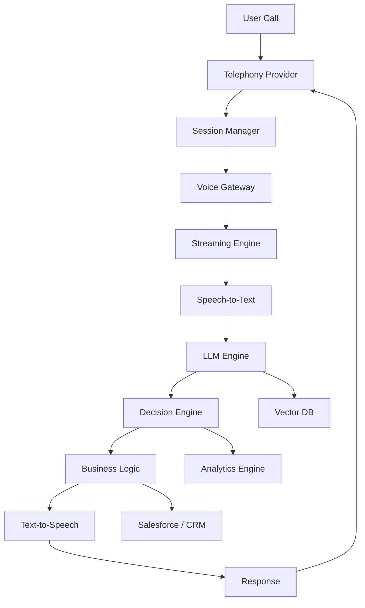

<!-- 🔥 PREMIUM ANIMATED BANNER -->

  

  

  

  

## About Me

* 14+ years of experience in **Enterprise Software Development**
* Expert in **React Native Architecture & Salesforce SDK Integrations**
* AI/ML Architect specializing in **AI Voice Agents & Automation Systems**
* Designing **scalable, offline-first enterprise applications**
* Strong experience in **CRM, ERP, and custom platform integrations**
* Hands-on with **Cloud (AWS), CI/CD, and distributed systems**

---

## What I Do

* Architect **enterprise-grade mobile & web platforms**
* Build **offline-first apps using Salesforce Mobile SDK**
* Design **AI Voice Agents (inbound/outbound automation systems)**
* Optimize systems for **high performance & scalability (500+ concurrent operations)**
* Implement **secure, scalable backend infrastructures**

---

## AI / Voice Agent Expertise

* AI Voice Agents (Outbound & Inbound Systems)
* Telephony Integrations & Call Automation
* LLM Integration & Conversational AI
* Real-time Streaming Pipelines
* Call Analytics & Intelligent Routing
* High-scale systems (10K+ calls/day architecture)

---

## AI Voice Agent Live Metrics

---

## Tech Stack

### Frontend

### Backend

### Databases

### Cloud & DevOps

---

## GitHub Stats

  
  

---

## Contribution Activity

  

  

---

## Achievements

  

---

## Enterprise AI Voice Architecture

---

## System Highlights

* 500+ concurrent calls
* 10K+ daily interactions
* Sub-200ms latency
* Cloud-native scalable architecture

---

## Featured Work

### AI Voice Agent Platform

* Handles **500+ parallel calls**
* Scalable for **10,000+ calls/day**
* Real-time voice processing
* LLM-powered decision engine
* Analytics & monitoring dashboard

---

### Salesforce Offline Apps

* Built with **Salesforce Mobile SDK**
* Fully **offline-first architecture**
* Smart sync & conflict resolution

---

## Case Studies

### AI Voice Agent Deployment

* Built enterprise AI calling system
* 500+ concurrent calls
* 10K+ calls/day
* Reduced manual workload drastically

---

### Salesforce Offline Platform

* Offline-first mobile app
* Smart sync + conflict resolution
* Increased field productivity

---

### Enterprise Automation

* CRM + ERP integrations
* Real-time workflows
* Improved operational efficiency

---

## Let’s Collaborate

* AI/ML & Voice Agent Systems
* React Native Architecture
* Salesforce SDK Implementations
* Enterprise Full Stack Solutions

---

## Contact

* 📧 [ankit.panwar0014@gmail.com](mailto:ankit.panwar0014@gmail.com)
* 📞 +91-9571901180
* 📞 +91-8619219680

---

## Fun Fact

I enjoy solving **complex engineering problems**, designing **scalable systems**, and building **high-performance AI platforms**
